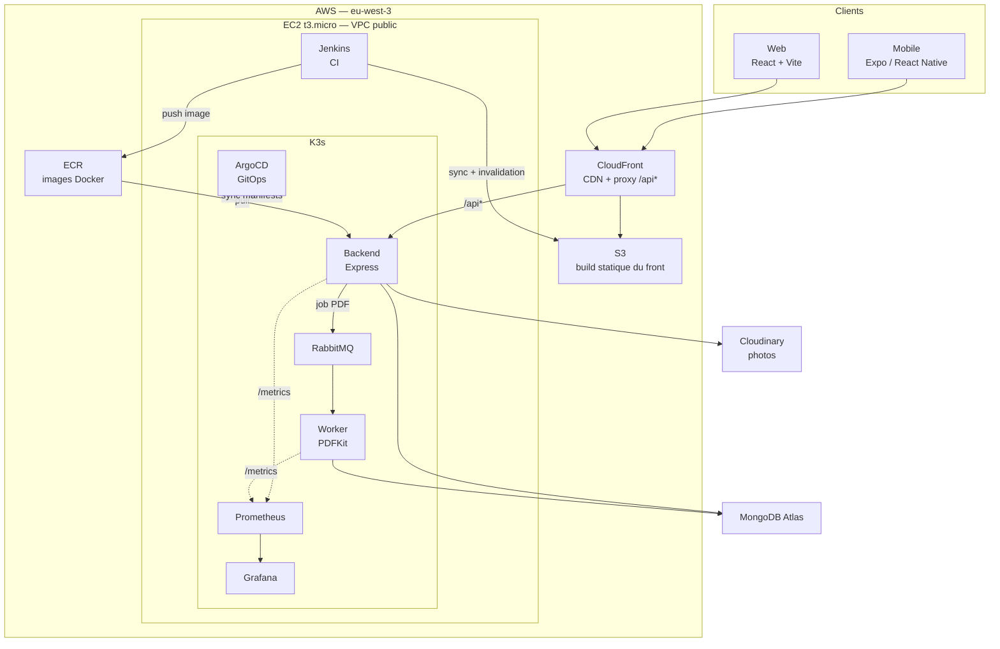
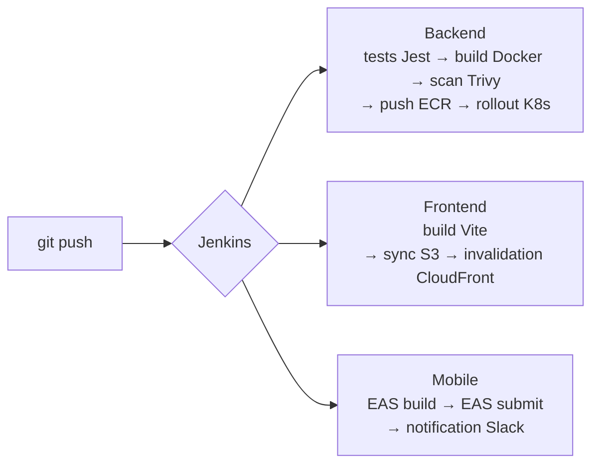

# AppBTP — DevOps Lab

Application de suivi de chantiers BTP (web + mobile), déployée de bout en bout sur AWS avec une chaîne DevOps complète : conteneurisation, infrastructure as code, CI/CD, orchestration Kubernetes et observabilité.

Ce dépôt est autant un projet applicatif qu'un **lab DevOps** : l'application sert de support réel pour construire et opérer une plateforme complète.


---

## Sommaire

- [Le métier](#le-métier)
- [Architecture](#architecture)
- [Stack technique](#stack-technique)
- [Chaîne CI/CD](#chaîne-cicd)
- [Observabilité](#observabilité)
- [Sécurité](#sécurité)
- [Démarrage rapide](#démarrage-rapide)
- [Structure du dépôt](#structure-du-dépôt)
- [Documentation](#documentation)
- [Contraintes et arbitrages](#contraintes-et-arbitrages)

---

## Le métier

Les conducteurs de travaux relèvent chaque jour sur chantier : effectifs présents, notes, constatations et rapports photo. L'application remplace le carnet papier :

- **Mobile (Expo/React Native)** — saisie terrain, y compris en mobilité
- **Web (React/Vite)** — consultation, administration, export
- **Rapports PDF** — générés en asynchrone par un worker dédié, pour ne jamais bloquer l'API

---

## Architecture



**Choix structurants**

| Décision | Raison |
|---|---|
| Front statique sur S3 + CloudFront | Coût quasi nul, TLS et cache gérés par AWS, aucun serveur à maintenir |
| Proxy `/api*` par CloudFront | Une seule origine côté navigateur : pas de CORS, pas de certificat séparé pour l'API |
| K3s plutôt que EKS | EKS coûte ~70 $/mois de control plane ; K3s tient sur le t3.micro déjà présent |
| Génération PDF via RabbitMQ | Un rapport photo peut prendre plusieurs secondes ; l'API répond immédiatement et le worker traite en arrière-plan |
| MongoDB Atlas | Sauvegardes et réplication managées, hors du périmètre à opérer |

---

## Stack technique

| Domaine | Outils |
|---|---|
| **IaC** | Terraform — modules AWS (VPC, EC2, ECR, S3, CloudFront, IAM) et modules Kubernetes (namespace, configmap, secret, deployments) |
| **Configuration** | Ansible — rôles `docker`, `security`, `monitoring`, `deployment` |
| **Conteneurs** | Docker, Docker Compose (stack complète en local), Dockerfiles multi-services |
| **Orchestration** | Kubernetes (K3s), Kustomize, ArgoCD |
| **CI/CD** | Jenkins — pipelines déclaratifs backend / frontend / mobile |
| **Observabilité** | Prometheus, Grafana, Loki, Promtail, alertes Prometheus |
| **Backend** | Node.js 22, Express, Mongoose, JWT, Helmet, rate limiting, `prom-client`, Winston |
| **Worker** | Node.js, `amqplib`, PDFKit |
| **Frontend** | React 18, Vite, React Router, Axios |
| **Mobile** | Expo (React Native), EAS Build |
| **Tests** | Jest + Supertest sur l'API (auth, notes) |

---

## Chaîne CI/CD

Trois pipelines Jenkins, un par livrable.



| Pipeline | Fichier | Étapes |
|---|---|---|
| Backend | [`jenkins/Jenkinsfile.backend`](jenkins/Jenkinsfile.backend) | `npm ci` → `npm test` (rapport JUnit) → build Docker → **scan Trivy** → push ECR → `kubectl set image` + `rollout status` |
| Frontend | [`jenkins/Jenkinsfile.frontend`](jenkins/Jenkinsfile.frontend) | `npm ci` → build Vite → `aws s3 sync --delete` → invalidation CloudFront |
| Mobile | [`jenkins/Jenkinsfile.mobile`](jenkins/Jenkinsfile.mobile) | `npm ci` → `eas build --platform android` → `eas submit` → notification Slack |

Les étapes de déploiement sont conditionnées à la branche `main` (`when { branch 'main' }`). Les secrets (URI MongoDB, secret JWT, token Expo) proviennent des credentials Jenkins, jamais du dépôt.

**GitOps** — ArgoCD surveille `kubernetes/` et resynchronise le cluster sur l'état du dépôt. Sur un `t3.micro`, Jenkins et ArgoCD ne tiennent pas ensemble en mémoire : [`kubernetes/argocd-toggle.sh`](kubernetes/argocd-toggle.sh) bascule de l'un à l'autre à la demande.

---

## Observabilité

- **Métriques** — le backend et le worker exposent `/metrics` via `prom-client` (latence, taux d'erreur, compteurs métier), scrapés par Prometheus
- **Logs** — Winston en JSON, collectés par Promtail et centralisés dans Loki
- **Dashboards** — Grafana provisionné par fichiers ([`monitoring/grafana/`](monitoring/grafana/)) : dashboard API et dashboard Kubernetes
- **Alertes** — [`monitoring/prometheus/alerts.yml`](monitoring/prometheus/alerts.yml)

| Alerte | Condition | Sévérité |
|---|---|---|
| `BackendDown` | `up == 0` pendant 1 min | critical |
| `HighErrorRate` | taux d'erreur API > 10 % pendant 2 min | warning |
| `HighResponseTime` | p95 > 2 s pendant 5 min | warning |

---

## Sécurité

- **Aucun secret dans Git** — `.env*`, `*.tfvars`, `*.tfstate` et les Secrets Kubernetes réels sont exclus ; seuls les modèles `.example` sont versionnés
- **Runtime** — secrets injectés via credentials Jenkins et Secrets Kubernetes ; jamais dans les images
- **API** — JWT, Helmet, rate limiting, middleware `isAdmin` sur les routes d'administration
- **IAM** — rôle d'instance dédié à Jenkins (ECR, S3, CloudFront), pas de clés d'accès statiques sur la machine
- **Réseau** — MongoDB et RabbitMQ non exposés publiquement ; contrôle automatisé par le rôle Ansible `security`

> `allowed_ssh_cidrs` vaut `0.0.0.0/0` dans l'exemple Terraform : c'est une valeur de lab, à restreindre à son IP avant tout usage réel.

---

## Démarrage rapide

**Stack complète en local** — API, worker, MongoDB, RabbitMQ, Jenkins, Prometheus, Grafana, Loki :

```bash
cp .env.example .env && docker compose up -d
```

| Service | URL |
|---|---|
| API | http://localhost:8081 |
| Grafana | http://localhost:3000 |
| Prometheus | http://localhost:9091 |
| RabbitMQ | http://localhost:15672 |
| Jenkins | http://localhost:8080 |

**Tests de l'API :**

```bash
cd backend && npm ci && npm test
```

**Infrastructure AWS :**

```bash
cd infra && cp terraform.tfvars.example terraform.tfvars && terraform init && terraform plan
```

**Déploiement Kubernetes :**

```bash
cp kubernetes/appbtp-secret.example.yaml kubernetes/appbtp-secret.yaml && kubectl apply -k kubernetes/backend
```

---

## Structure du dépôt

```
.
├── infra/              Terraform AWS — VPC, EC2, ECR, S3, CloudFront, IAM
├── terraform/          Terraform Kubernetes — namespace, configmaps, secrets, deployments
├── ansible/            Rôles docker / security / monitoring / deployment
├── docker/             Dockerfiles par service + configs nginx
├── kubernetes/         Manifests K8s, Kustomize, bascule ArgoCD
├── jenkins/            Pipelines et configuration des jobs
├── monitoring/         Prometheus, Grafana, Loki, Promtail
├── backend/            API Express + tests Jest
├── worker/             Worker RabbitMQ → PDF
├── frontend/           SPA React + Vite
├── mobile/             Application Expo
├── database/           Scripts d'init et de seed MongoDB
└── documentation/      Documentation technique détaillée
```

---

## Documentation

| Document | Contenu |
|---|---|
| [architecture.md](documentation/architecture.md) | Vue d'ensemble, services, ports, flux |
| [terraform.md](documentation/terraform.md) | Modules, variables, workflow |
| [kubernetes.md](documentation/kubernetes.md) | Manifests, déploiement, ArgoCD |
| [jenkins.md](documentation/jenkins.md) | Pipelines, credentials, jobs |
| [docker.md](documentation/docker.md) | Images, Compose, optimisations |
| [ansible.md](documentation/ansible.md) | Rôles et playbook |
| [monitoring.md](documentation/monitoring.md) | Métriques, dashboards, alertes |
| [mongodb.md](documentation/mongodb.md) | Schéma, index, sauvegardes |
| [security.md](documentation/security.md) | Gestion des secrets, IAM, durcissement |
| [incident-response.md](documentation/incident-response.md) | Runbook incidents |

---

## Contraintes et arbitrages

Le lab tourne sur du free tier AWS. Les contraintes sont réelles et les arbitrages assumés :

- **1 Go de RAM sur le `t3.micro`** — Jenkins et ArgoCD ne cohabitent pas ; d'où le script de bascule plutôt qu'un runner externe payant
- **Nœud unique** — pas de haute disponibilité : le lab démontre la chaîne de déploiement, pas la résilience multi-AZ
- **Un seul environnement** — `.env.dev` / `.env.staging` / `.env.prod` sont préparés, mais un seul cluster existe
- **`terraform.tfstate` en local** — un backend S3 + verrouillage DynamoDB serait la suite logique en contexte multi-personnes

Prochaines étapes envisagées : backend S3 + verrouillage DynamoDB pour l'état Terraform, blocage du build sur les CVE critiques remontées par Trivy (aujourd'hui en `|| true`), et sealed-secrets pour sortir les Secrets Kubernetes du flux manuel.
